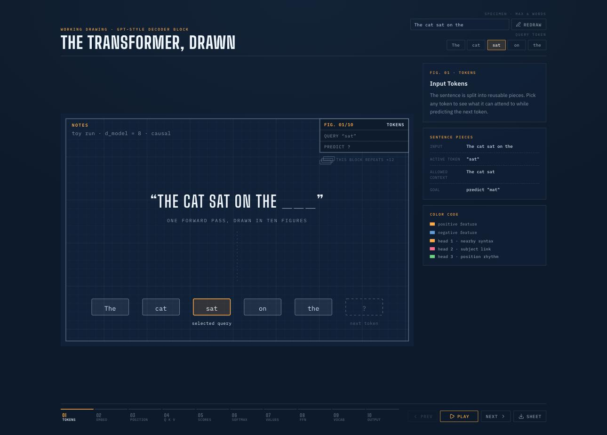
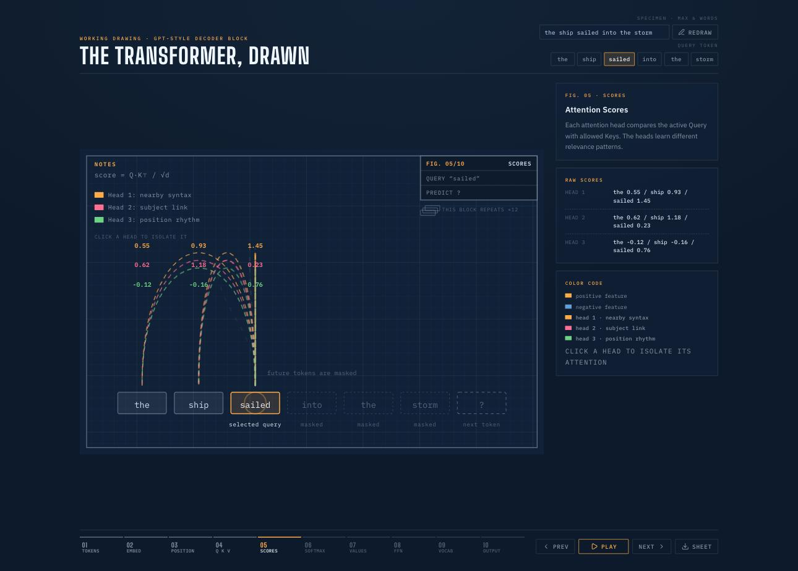

# The Transformer, Drawn

**An interactive working drawing of a GPT-style decoder block.** One sentence goes through one forward pass — tokens → embeddings → attention → feed-forward → next-token probabilities — drawn step by step in ten figures on a blueprint-style schematic, with every number on the sheet coming from a real (toy) computation you can follow by hand.



## Why this exists

Most transformer explainers live at one of two altitudes: architecture block diagrams (too high to see the arithmetic) or tensor equations (too low to see the story). This project sits deliberately in between. The model is shrunk until every value fits on one drawing — 8-dimensional vectors, 3 attention heads, a 5-word vocabulary — so you can watch the actual mechanics of next-token prediction: what a Query is *for*, why masking exists, what softmax does to scores, and how temperature reshapes the final distribution.

It's built for students meeting attention for the first time, and for anyone who has read ["Attention Is All You Need"](https://arxiv.org/abs/1706.03762) and still wants to *see* it.

## Quick start

```bash
npm install
npm run dev
```

Open `http://localhost:5173`. No API keys, no downloads, no GPU — the whole "model" is a few hundred lines of seeded arithmetic.

## The ten figures

| Fig. | Stage | What you see |
|------|-------|--------------|
| 01 | **Input tokens** | The sentence split into pieces, plus a dashed slot for the token to be predicted |
| 02 | **Embeddings** | Each token as an 8-cell heat strip (amber = positive feature, blue = negative) |
| 03 | **Positional encoding** | A wave pattern added so the two "the"s stop being identical |
| 04 | **Q, K, V** | Every token split into Query / Key / Value lanes |
| 05 | **Attention scores** | Each head's `Q·K⊤ / √d` comparisons drawn as arcs; future tokens masked |
| 06 | **Softmax weights** | Scores become percentages — per head, summing to 100% |
| 07 | **Value aggregation** | Weighted Value blends flow back along the arcs and merge into one context vector |
| 08 | **Feed-forward network** | Expand 8 → 16, mix, contract back to 8 |
| 09 | **Vocabulary projection** | The final vector scored against vocabulary rows → logits |
| 10 | **Final softmax** | Logits become probabilities; the title block resolves `PREDICT ?` |

Each figure carries its governing formula in the sheet's NOTES block (`score = Q·K⊤ / √d`, `p = softmax(logits / T)`, …), so the drawing maps directly onto the notation you'll meet in papers.

## Things to try

- **Write your own specimen.** Type any sentence (up to 6 words) in the header and hit *Redraw*. The simulation rebuilds deterministically — the same word always gets the same toy embedding, so you can compare sentences meaningfully.
- **Move the query.** Click a different token and watch the causal mask shift with it: token *n* can only attend to tokens 0…n. Select the first token to see why it can only attend to itself.
- **Isolate one head.** On the attention figures, click a head in the legend. The other heads dim, and one head's "opinion" — near-neighbor syntax, subject linking, positional rhythm — becomes legible on its own.
- **Turn the temperature dial.** On Fig. 10, drag T from 0.2 (greedy — the winner takes ~99%) to 3.0 (near-uniform — sampling gets adventurous). This is exactly the `temperature` parameter you set in LLM APIs.
- **Export the sheet.** The *Sheet* button downloads the current figure as a standalone SVG — useful for slides, handouts, or printing.
- **Drive it from the keyboard.** `←` / `→` step through figures, `Space` plays and pauses.



## What's real and what's toy

Educational honesty matters. This app teaches the *dataflow and mechanics* of a transformer truthfully, but it does not contain a trained model:

| Real | Toy |
|------|-----|
| The pipeline order and shapes (embed → +position → Q/K/V → scores → softmax → weighted values → FFN → logits → softmax) | Embeddings and Q/K/V vectors are seeded pseudo-random, derived from a hash of the token text — no learned weights |
| The arithmetic: dot products, `√d` scaling, per-head softmax, weighted sums, temperature scaling are all computed for real on the numbers shown | The three heads' "personalities" are hand-written bias functions, standing in for what training would discover |
| Causal masking — future tokens genuinely never contribute | The vocabulary is 5 candidates chosen from a word pool by sentence hash (the default sentence keeps its classic `mat` ending) |
| Softmax outputs really sum to 100%; temperature really reshapes them | The FFN "computation" is illustrative mixing, not a learned MLP |

A real GPT does exactly what this drawing does — just with `d_model ≈ 12,288` instead of 8, ~96 heads instead of 3, a ~100k-token vocabulary instead of 5, and the block stacked ~dozens of times (see the "×12" note under the title block).

## How the code is organized

```
src/
├── simulationData.ts        # The entire "model": buildSimulation(sentence) → tokens,
│                            #   vectors, attention heads, logits. Pure, seeded, testable.
├── components/
│   └── TransformerBoard.tsx # The SVG sheet: one small component per figure, plus the
│                            #   grid, drawing frame, NOTES block, and live title block.
├── App.tsx                  # Lesson state (step, query token, solo head, temperature),
│                            #   header/sidebar/transport UI, keyboard controls.
├── exportSheet.ts           # Clones the SVG, inlines board CSS + fonts, downloads it.
└── index.css                # The design system: palette, type, layout, board styles.
```

There is no state library and no chart library — the board is hand-drawn SVG, which is the point: every mark on the sheet is a deliberate teaching decision.

**Stack:** React 19 · Vite · TypeScript · vanilla CSS · [Lucide](https://lucide.dev/) icons.

## Design language

The UI is styled as an engineer's working drawing — we do call it the transformer *architecture*, after all. Prussian drafting paper, a fine grid, chalk-white linework, and amber/rose/green annotation pencils for the attention heads. The title block in the sheet corner tracks lesson state in drawing-title-block vernacular (`FIG. 05/10 · SCORES`, `QUERY "sat"`, `PREDICT ?`), and each figure's formula appears in the NOTES block, the way real drawings carry general notes. Type is [Big Shoulders](https://fonts.google.com/specimen/Big+Shoulders), IBM Plex Sans, and IBM Plex Mono.

Accessibility floor: keyboard-driveable, visible focus states, `prefers-reduced-motion` respected.

## Going further

If this drawing clicked for you, these pair well with it:

- [Attention Is All You Need](https://arxiv.org/abs/1706.03762) — the original paper; Fig. 05–07 here are its Figure 2, animated
- [The Illustrated Transformer](https://jalammar.github.io/illustrated-transformer/) — Jay Alammar's classic visual walkthrough
- [3Blue1Brown: Visualizing Attention](https://www.youtube.com/watch?v=eMlx5fFNoYc) — the linear-algebra intuition
- [nanoGPT](https://github.com/karpathy/nanoGPT) — when you're ready to read a real trained decoder in ~300 lines of code

## License & Author

Created by [Pedro Acosta](https://github.com/poacosta). Released under the MIT License.
